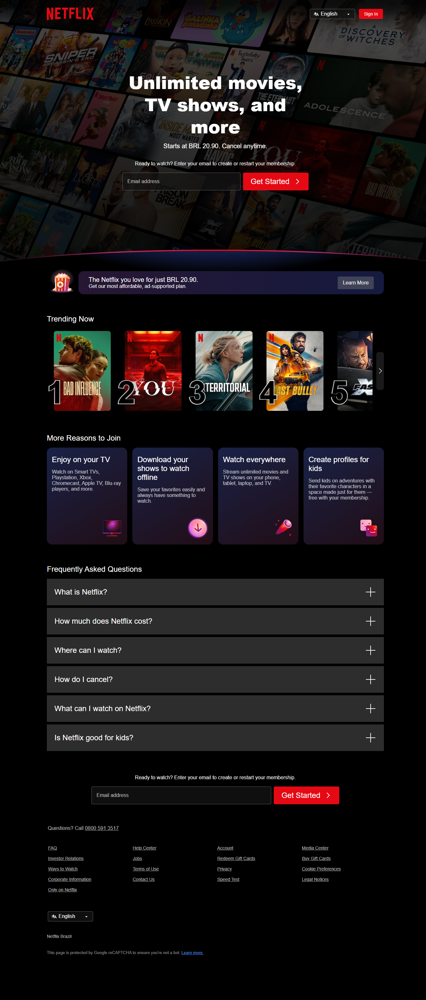
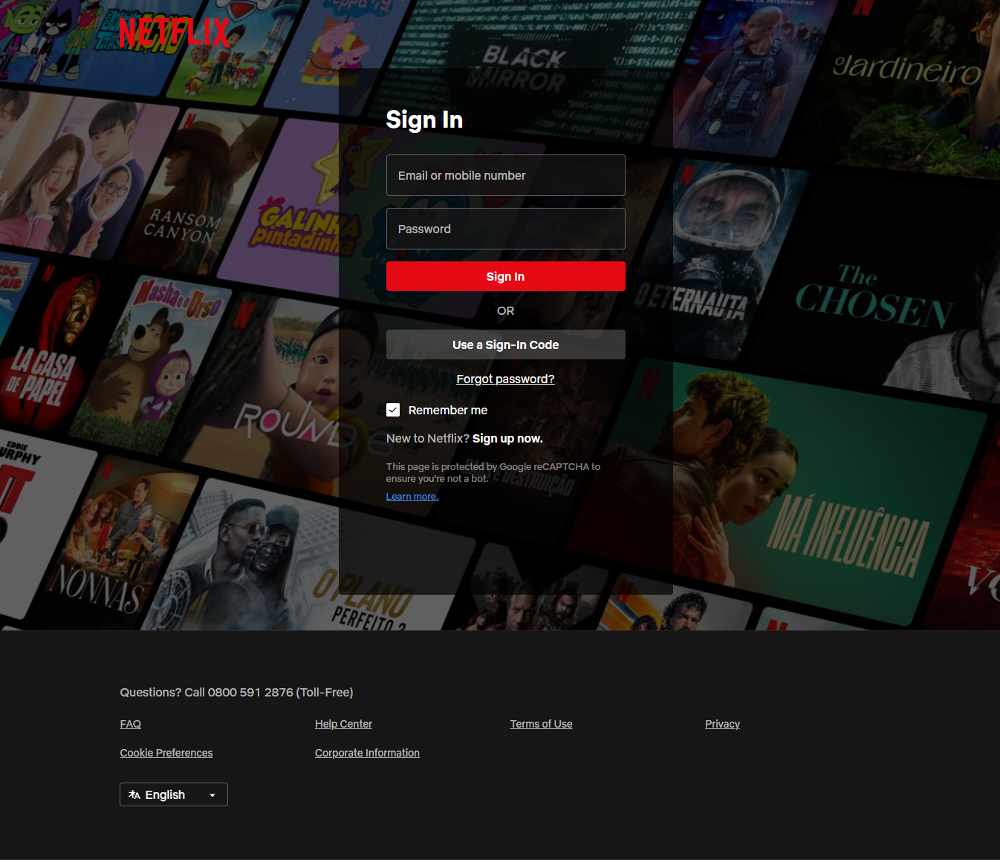

# Netflix Replica

<div align="center">

    

</div>

## 📋 Content

1. [About](#-about)
1. [Goals](#-goals)
1. [Built With](#-built-with)
1. [Installation](#-installation)
1. [Media](#️-media)
1. [References](#-references)
1. [Contributing](#-contributing)

## ℹ️ About

This project aims to develop a functional **front-end replica** of the Netflix streaming platform, built with ReactJS and TailwindCSS, based in the user interface of the Microsoft Edge browser.

## ✅ Goals

- [ ] Recreate Netflix UI (Microsoft Edge version)
- [ ] Build a responsive desktop layout
- [ ] Implement core front-end features
  - [ ] Landing page (UI only)
  - [ ] Login page (UI only)
  - [ ] Registration page (UI only)
- [ ] Support English and Portuguese languages
- [ ] Project documentation completed and updated

## 📦 Built With

| Technology   | Version | Reference                                                                                 |
| ------------ | ------- | ----------------------------------------------------------------------------------------- |
| React        | 19.0.0  | [About]("https://react.dev/blog/2024/12/05/react-19")                                     |
| React Router | 7.2.0   | [About]("https://reactrouter.com/7.2.0/home")                                             |
| Vite         | 5.4.11  | [About]("https://vite.dev/guide/")                                                        |
| TailwindCSS  | 4.0.0   | [About]("https://tailwindcss.com/docs/installation/using-vite")                           |
| Typescript   | 5.7.2   | [About]("https://www.typescriptlang.org/docs/handbook/release-notes/typescript-5-7.html") |
| Lucide React | 0.511.0 | [About]("https://lucide.dev/guide/packages/lucide-react")                                 |

## 📥 Installation

1. Clone the repository

```bash
  git clone https://github.com/zTiagok/project.netflix.reactjs
```

2. Access the repository folder

```bash
  cd project.netflix.reactjs
```

3. Install the dependencies

```bash
  npm install
```

4. Start the project

```bash
  npm run start
```

## 🖼️ Media

##### References (Microsoft Edge Version)

<details>
  <summary>Landing Page</summary>
  
</details>
<details>
  <summary>Login Page</summary>
  
</details>
<details>
  <summary>Registration Page</summary>
  
</details>

## 📚 References

- [Netflix](https://www.netflix.com/br-en/)

## 💡 Contributing

Feel free to open an [issue](https://github.com/zTiagok/project.netflix.reactjs/issues) if you have any suggestions, ideas or improvements for this project.
